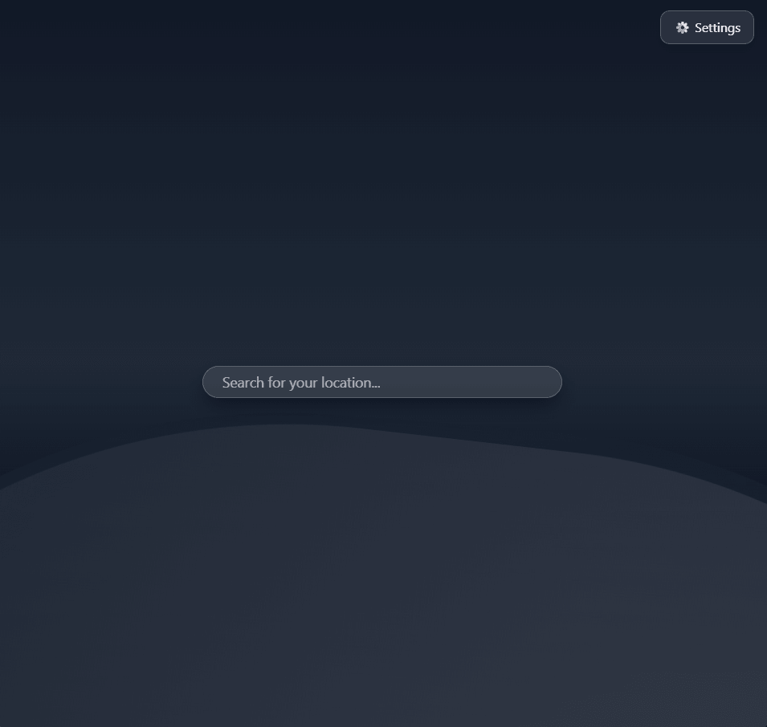
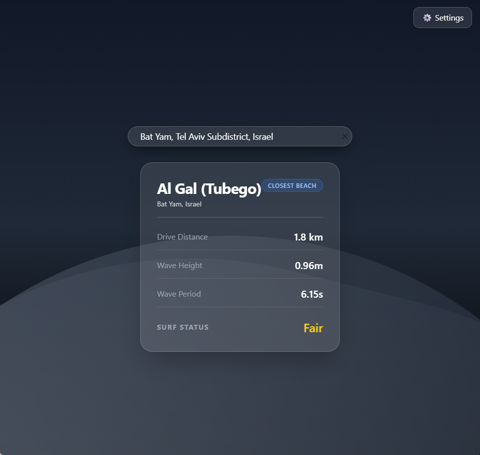

# Surf Forecast Advisor 🏄‍♂️

A sleek, full-stack application that provides surfers with real-time insights into wave conditions. By processing marine meteorological data through a custom evaluation algorithm, it helps users determine the best time and location for a session.

## 📱 Screenshots

| Search State | Forecast View |
| :---: | :---: |
|  |  |


## ✨ Key Features

- **Automated Surf Evaluation:** Translates raw data (height/period) into a readable "Surf Status" (e.g., Good, Fair, Flat).
- **Proximity Detection:** Automatically identifies and tags the "Closest Beach" based on search input and GPS distance.
- **Dynamic Search:** Real-time location suggestions powered by Geoapify.
- **Modern UI/UX:** A clean, dark-themed dashboard built with Tailwind CSS for high readability in outdoor settings.
- **Containerized Environment:** Fully Dockerized for seamless development and deployment.

## 🛠️ Tech Stack

### Backend
- **Framework:** FastAPI (Python)
- **Database:** MongoDB
- **APIs:** Open-Meteo Marine (Wave Data) & Geoapify (Geocoding)

### Frontend
- **Framework:** React.js with **TypeScript**
- **Build Tool:** Vite
- **Styling:** Tailwind CSS
- **State Management:** React Context API (Settings management)

## 📁 Project Structure

```text
FORECAST-ADVISOR/
├── backend/
│   ├── models/          # Data schemas
│   ├── routes/          # API endpoints
│   ├── services/        # Business logic & API integrations
│   ├── main.py          # FastAPI entry point
│   └── Dockerfile
├── frontend/
│   ├── src/
│   │   ├── components/  # BeachCard, LocationSearch, etc.
│   │   ├── context/     # SettingsContext for global state
│   │   └── main.tsx     # React entry point
│   └── Dockerfile
├── docker-compose.yml   # Multi-container orchestration
└── .env                 # Environment variables (API keys)
```

## 🚀 Getting Started

### Prerequisites
- Docker & Docker Compose

### Setup

1. **Clone & Navigate:**
   ```bash
   git clone https://github.com/[your-username]/surf-forecast-advisor.git
   cd surf-forecast-advisor
   ```

2. **Configuration:**
   Create a `.env` file in the root with your credentials:
   ```env
   GEOAPIFY_API_KEY=your_key_here
   MONGODB_URL=mongodb://mongodb:27017
   ```

3. **Run:**
   ```bash
   docker-compose up --build
   ```
   - **Frontend:** http://localhost:5173 (Vite default)
   - **Backend API:** http://localhost:8000/docs

## 📄 License

Distributed under the MIT License.